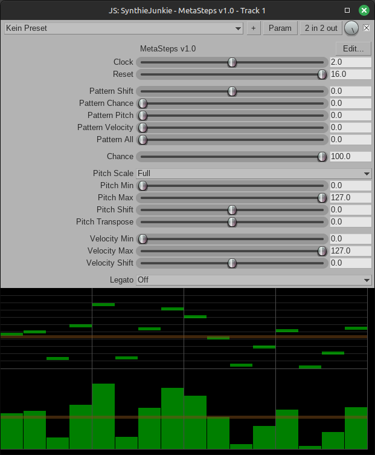

# MetaSteps v1.0
Ein experimenteller, zufallsgesteuerter Step-Sequencer/Noten-Erzeuger für REAPER in JSFX.

# Beschreibung
Dieses Plugin ist kein klassischer 16-Step-Sequencer. Es ist ein kreatives Werkzeug zur Muster- und Klangvariation, das **musikalische Strukturen über Wahrscheinlichkeiten, Logik und kontrolliertes Chaos** formt. Durch eine Mischung aus algorithmischer Kontrolle und improvisatorischer Offenheit entsteht ein lebendiges, sich wandelndes Pattern-Verhalten – ideal für **generative Komposition, Sound-Design und Live-Improvisation.**
